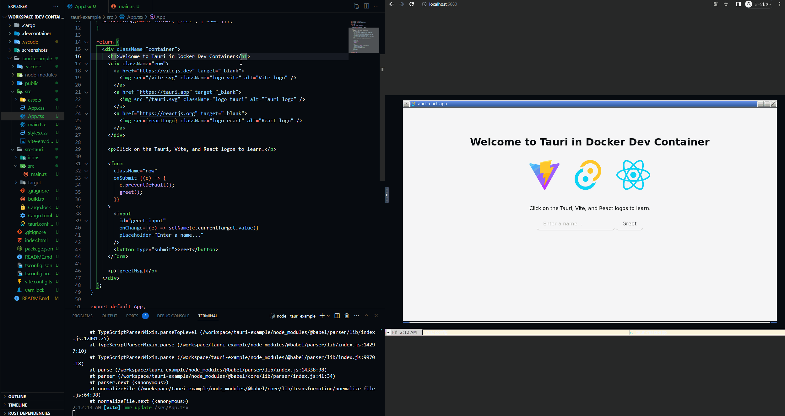
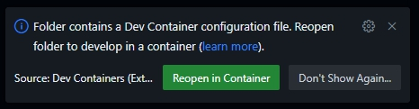
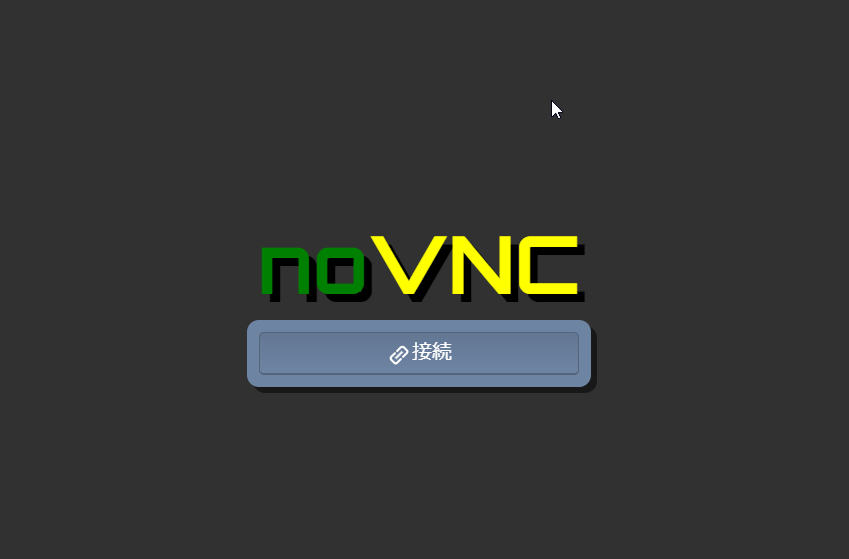
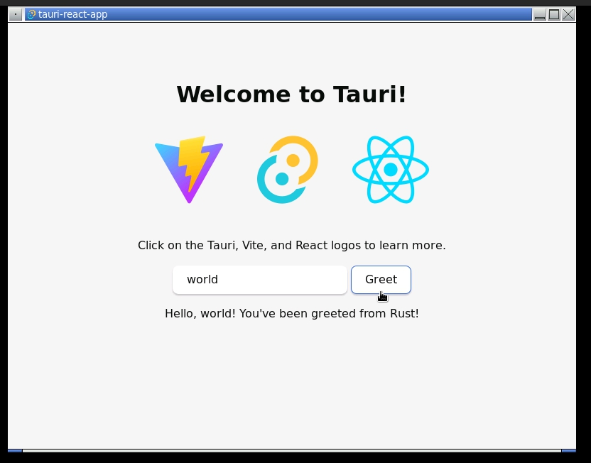

# Dev Container for Tauri



This is a playground for [Tauri](https://tauri.app/) app development. You can leverage the hot reloading feature of Tauri(or rather Vite?) inside the Docker container.
~~At the moment, Neither hot reloading nor even reloading work properly on the VNC display in the container, and the cause is still under investigation.~~
→ On Windows, using WSL2(Windows Subsystem for Linux 2) resolved the problem and also saved a large amount of time at building containers and compiling Rust backend.

Keywords:
- Windows, WSL2, Linux, VS Code, Dev Containers, Docker, Tauri, Vite, Rust, React, TypeScript

## Prerequisites

- You have installed:

  - Docker Desktop
  - VS Code

on your local machine.

- You have added the following VS Code extensions:
  - Dev Containers([Remote Development](https://code.visualstudio.com/docs/remote/remote-overview) for Windows users instead)
  - Docker

## Notes

- It's unclear whether this works properly on Mac OS
- **If you use Windows PC, then use WSL2, otherwise hot reloading cannot fire, which leads to tremendous inconvenience**

## How to use

1. Run your Docker Desktop
2. Create the docker image and run the container

- Select the menu "Dev Containers: Reopen in Container".
- You could also select "Reopen in Container" in a pop-up toaster that appears at the bottom right on VS Code when opening
  - 

3. Create your Tauri app template
\* **Skip this if you use the existing tauri-example or git clone other repos**
- Execute the command:

```
yarn create tauri-app
```

- Follow the prompts and choose your preferences
  - In tauri-example, they are the followings:
    - Project name: *tauri-example*
    - Choose which language to use for your frontend: *TypeScript / JavaScript*
    - Choose your package manager: *yarn*
    - Choose your UI template: *React*
    - Choose your UI flavor: *TypeScript*

4. Move to the project directory

```
cd ${--Project name here--}
```

5. Add dependencies in package.json to the project

```
yarn
```

6. Open a dev browser

- Execute the command:
\* **It could take some minutes the first time because of having to building backend. Later, it would be much faster by using cache.**

```
yarn tauri dev
```

- Open localhost:6080 (the port number is defined in devcontainer.json)
  - http://localhost:6080/
- Connect to noVNC with the password set in devcontainer.json ("vscode" in this example)
  - 
- Now all taken care of! It automatically detects changes on both frontend and backend and reflects them on the browser by hot reloading.
  - \* **It could be tremendously slow when it comes to backend though. In that case, stop dev server during tinkering with backend.**
  - 

## How to check database connections in a container

Execute the command below
```
psql -d db -U postgres
```
